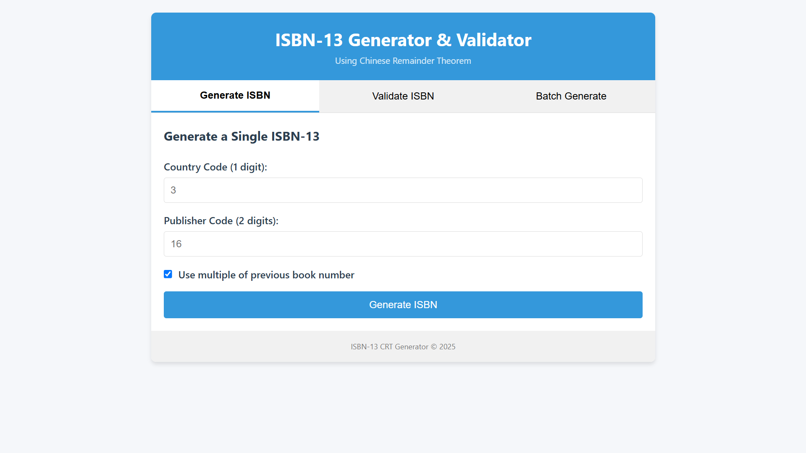

# ISBN-13 Generator and Validator

A web application for generating and validating ISBN-13 codes using the Chinese Remainder Theorem (CRT).

## Features

- Generate ISBN-13 codes that satisfy the CRT conditions
- Validate existing ISBN-13 codes
- Generate multiple ISBNs in batch
- Download generated ISBNs as text files
- Clean, minimalistic user interface

## Web Interface

The application provides a clean, intuitive web interface for generating and validating ISBN-13 codes:



## Requirements

- Python 3.6+
- Flask

## Installation

1. Clone this repository:
   ```
   git clone <repository-url>
   cd isbn13-crt
   ```

2. Install the required packages:
   ```
   pip install -r requirements.txt
   ```

## Usage

1. Start the web server:
   ```
   python app.py
   ```

2. Open your web browser and navigate to:
   ```
   http://localhost:5000
   ```

## How to Use

### Generate a Single ISBN

1. Click on the "Generate ISBN" tab
2. Enter a country code (1 digit)
3. Enter a publisher code (2 digits)
4. Select whether to use multiples of previous book numbers
5. Click "Generate ISBN"

### Validate an ISBN

1. Click on the "Validate ISBN" tab
2. Enter a 13-digit ISBN (without hyphens)
3. Click "Validate ISBN"
4. The result will show if the ISBN is valid according to the CRT rules

### Generate Multiple ISBNs

1. Click on the "Batch Generate" tab
2. Enter a country code (1 digit)
3. Enter a publisher code (2 digits)
4. Enter the number of ISBNs to generate (1-100)
5. Select whether to use multiples of previous book numbers
6. Click "Generate ISBNs"
7. You can download the generated ISBNs as a text file

## How It Works

ISBN-13 codes are generated using the Chinese Remainder Theorem (CRT) with moduli 3, 5, and 7. 

For a valid ISBN with publisher code X, the full ISBN Y must satisfy:
- Y mod 3 = X mod 3
- Y mod 5 = X mod 5
- Y mod 7 = X mod 7

The application implements two methods for generating ISBNs:
1. Using offsets with CRT to generate unique ISBNs
2. Using multiples of previous book numbers that satisfy the CRT conditions

All generated ISBNs are stored in a JSON file to prevent duplicates. 